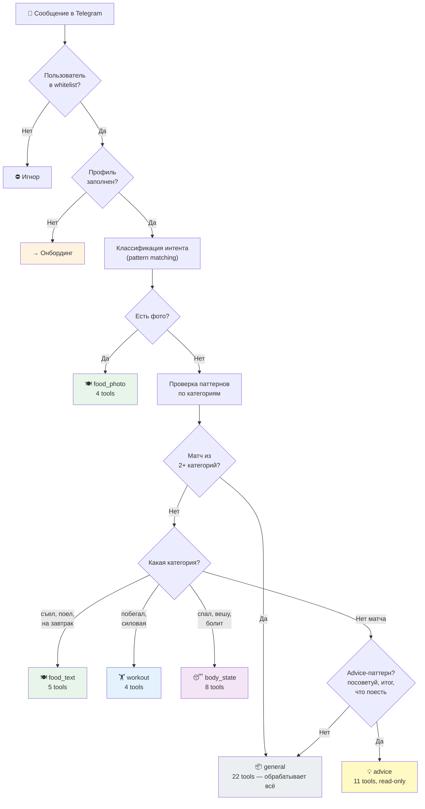
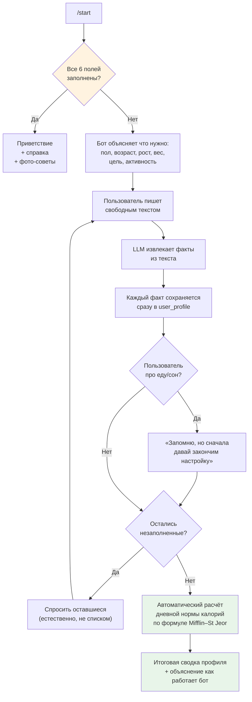
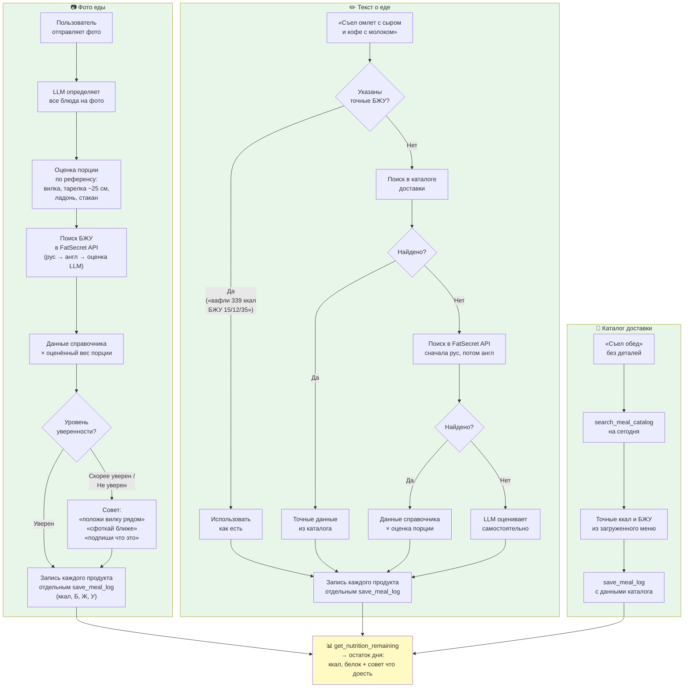
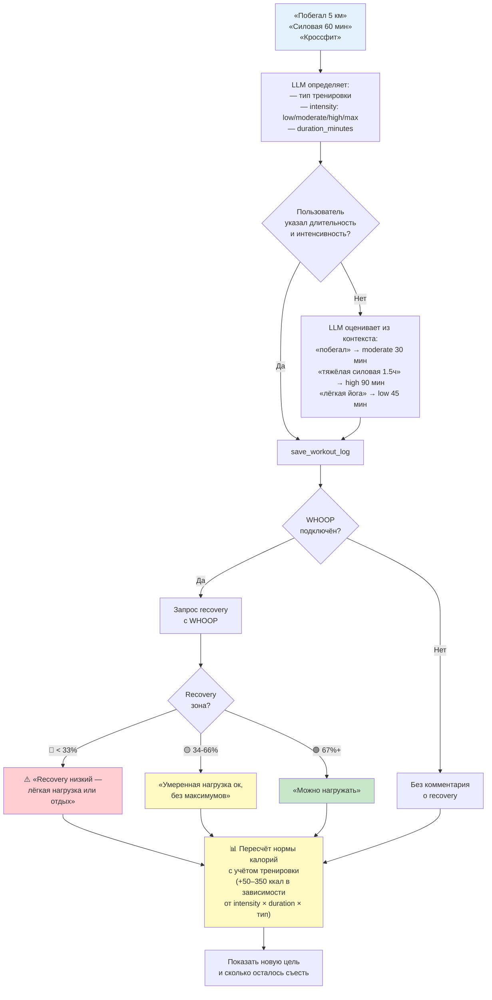
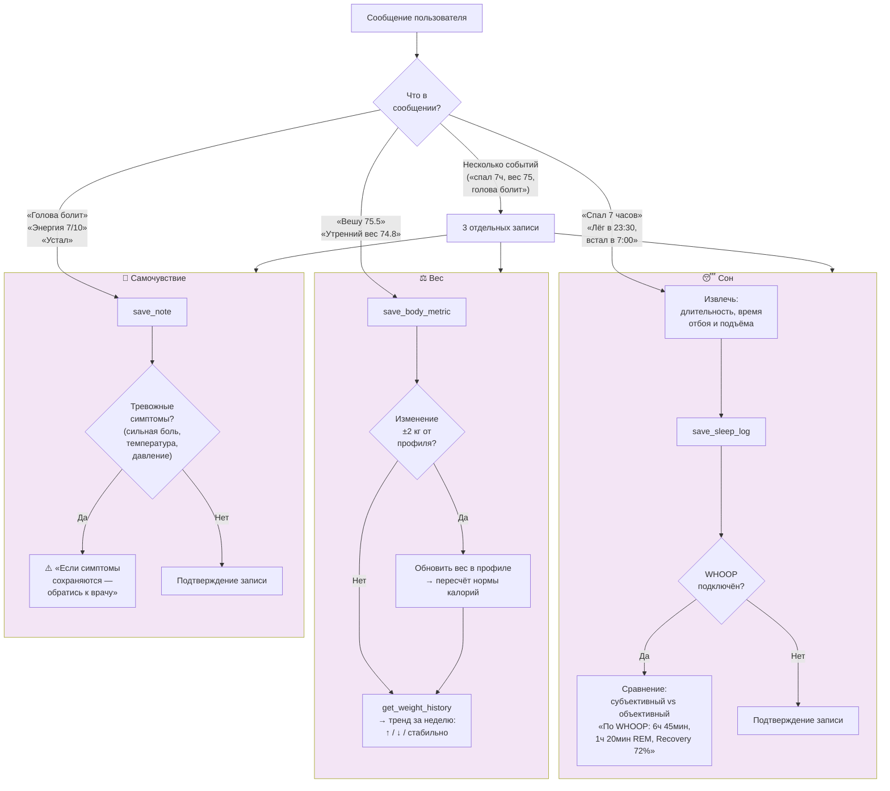
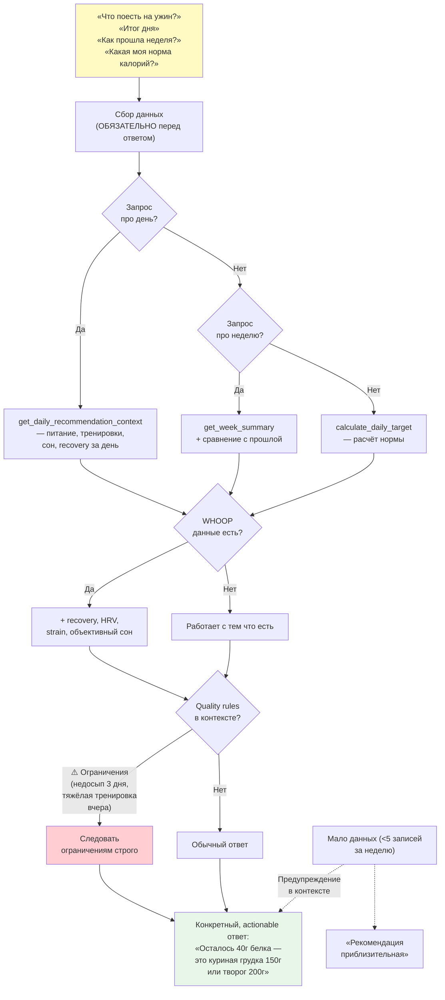
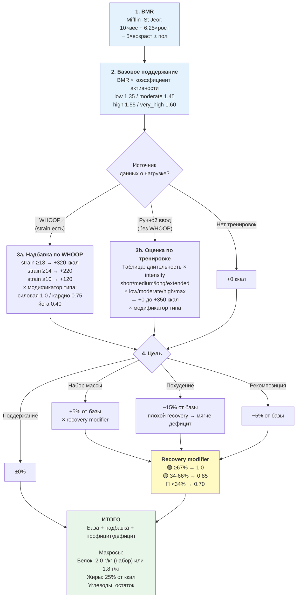
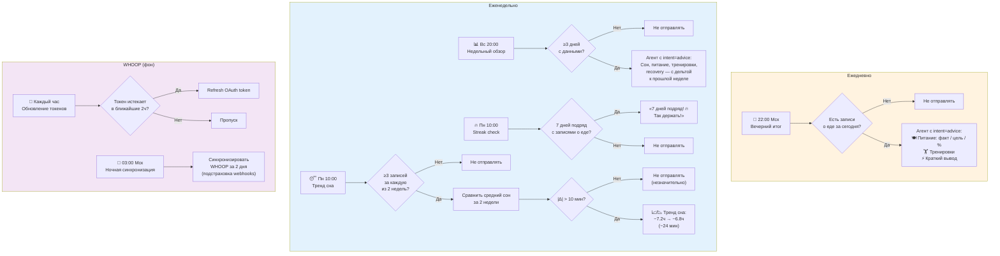
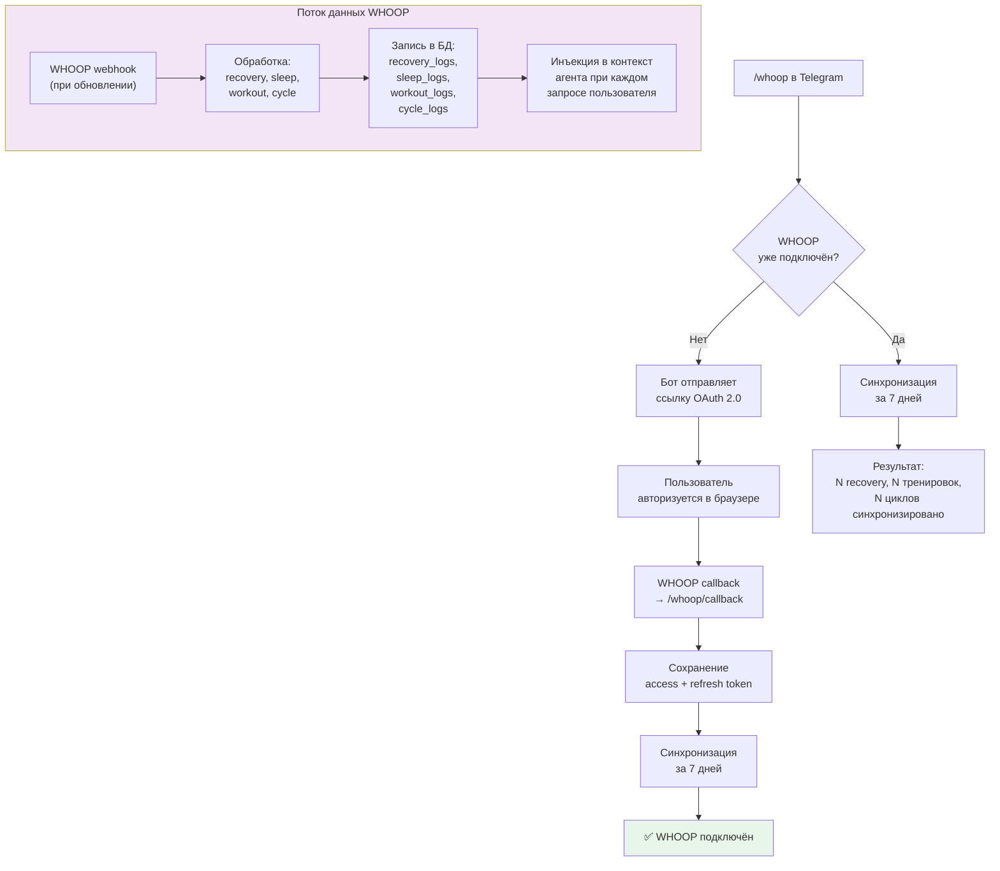
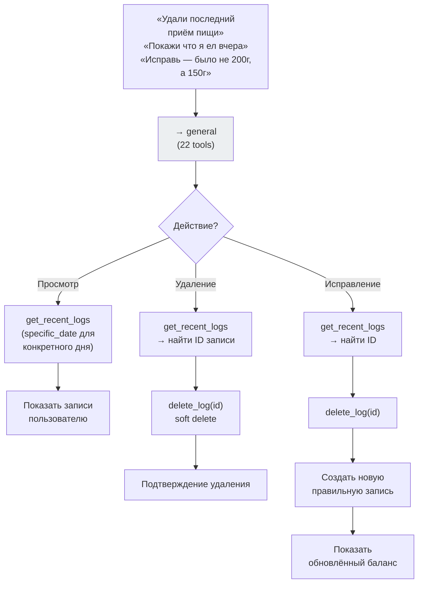

# Health Agent — Бизнес-схемы

## 1. Точка входа: маршрутизация сообщения

## 2. Онбординг

## 3. Запись питания

## 4. Запись тренировки

## 5. Запись сна, веса, самочувствия

## 6. Рекомендации и аналитика

## 7. Расчёт дневной нормы калорий

## 8. Проактивные сообщения (по расписанию)

## 9. WHOOP-интеграция

## 10. Управление записями

